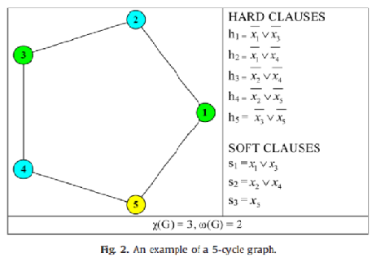

# Brief Introduction of BBMCX algorithm solving Maximum Clique Problem

Qianyang Zeng

BBmcx is an algorithm improved from MaxCLQ algorithm. MaxCLQ use Infra-chromatic bound which is tighter than the chromatic number as the upper-bound of clique number. It defines the independent set based MaxSAT encoding of MCP, including hard clauses and soft clauses. Each soft clauses corresponds to an independent set, so the number of soft clauses equals to chromatic number. But not all the soft clauses can be satisfied simultaneously, and the subset of soft clause which cannot be satisfied simultaneously is called an ***inconsistent subset***. **In the language of graph theory, an *inconsistent subset* is a set of independent sets, that it is impossible to form a clique by selecting vertex from each independent set in inconsistent set.**

So the important proposition in MaxCLQ algorithm is: the upper-bound of clique number is **chromatic number minus the number of disjoint inconsistent subsets**. This upper-bound is called Infra-chromatic bound.

We can first look at a simple example (5-loop graph) to illustrate this proposition. 
 

In this 5-loop graph, the vertex in the graph are divided into three different color sets (independent sets). It can be seen that the max clique must contain vertex 5 (yellow set), and it can only contains either point 4 (blue set) or point 1 (green set) but cannot contain both. So, the upper bound of the max clique here is going to be 2, which is **chromatic number 3 minus 1**, and this 1 is going to be **the number of inconsistent subsets**.

We already know that a clique cannot have mutiple vertex from the same independent set. While this example shows that to form a clique by selecting one point from each of these independent sets is often infeasible. So **clique number is often less than the chromatic number**. If we divide all the independent sets of this graph into many **disjoint inconsistent subsets**, then a clique can only exist by removing an independent set from each inconsistent subset and selecting one point from each of the remaining independent set. So it proves that the chromatic number (i.e. the number of independent sets) minus the number of disjoint inconsistent subsets is bigger than clique number.

So, the key is the number of disjoint inconsistent subsets, which determines the upper bound for clique number. While MaxCLQ search inconsistent subsets for more than three colors, the new algorithm, BBmcx, searches for disjoint inconsistent subsets of only three colors, which forms a ***minimal inconsistent subset***. If removing one color from this minimal inconsistent subset, then the remaining colors will not form an inconsistent subset, that is, a clique can be formed from the points selected from the remaining independent sets.

Since two colors must can form a clique, **a minimal inconsistent subset must contains at least 3 colors**, which is what BBmcx is looking for.

Among the 3 colors, two are below the pruning factor, ***kmin***, while one is beyond ***kmin***, whose independent set only contains one vertex. As a result, BBmcx can find out the number of disjoint inconsistent subsets in a more rapid way, and finally get the upper-bound of clique number.

The process of computing the inconsistent subset of only 3 colors is supported by the following proposition: **If there is no vertex in color set C2 adjacent to both vertex w belongs to C1 and vertex v, then (C1, C2, {v}) is an inconsistent subset**. This is obvious because if there is a clique that contains both w in C1, u in C2 and v, then u must be adjacent to both w and v, which is inconsistent with the premise.

As a result, BBmcx runs this process on every vertex whose color is beyond kmin. If the process succeeds, the vertex v that is beyond kmin will be removed from its original color set and forms a unique color set. And then the upper bound is computed according to the color sets below kmin and the unique set.
